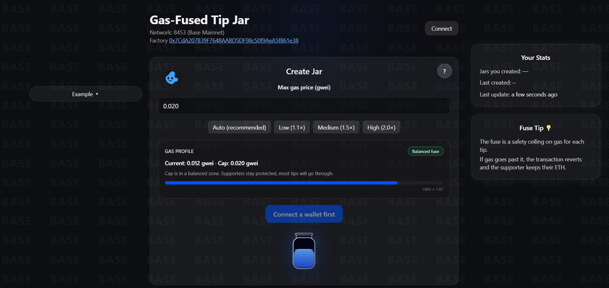
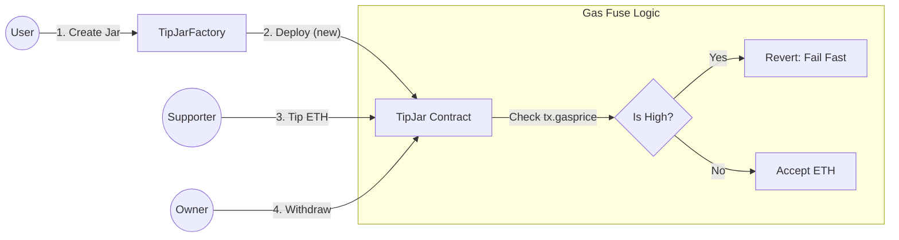

# Gas-Fused Tip Jar 

A sovereign tip jar on Base that respects your gas limits.
**No backend. No bots. 100% on-chain.**



> "Simplicity is the ultimate sophistication."

---

## The Problem

Most "gas protection" tools rely on off-chain relayers, keepers, or Python scripts monitoring the mempool.
**Critique:** If the server dies, the protection dies. Complexity breeds fragility.

## The Solution: Dual-Layer Fuse

I built a system that enforces gas limits **directly inside the EVM**. It acts like an electrical fuse:

1.  **UI Layer (Prevention):** The frontend estimates gas and warns the user before signing.
2.  **EVM Layer (Enforcement):** If the network spikes locally or the UI is bypassed, the contract checks `tx.gasprice` opcode immediately.

> **Fail Fast:** A revert still consumes a tiny amount of gas. By placing the `withinGasCap` modifier first, we minimize this cost to the absolute opcode minimum.

---

## Architecture

We reject the complexity of proxies (ERC-1167) in favor of **Sovereign Contracts**.



---

## Design Philosophy (First Principles)

### 1. The Fuse (Opcode Level)

Instead of an Oracle, I check the raw `tx.gasprice` opcode. It is efficient, free to read, and impossible to spoof.

```solidity
modifier withinGasCap() {
    // Fail fast to save gas.
    if (tx.gasprice > maxGasPriceWei) revert GasPriceTooHigh();
    _;
}

```

### 2. Sovereign Contracts > Proxies

You will notice `TipJarFactory.sol` creates jars using `new TipJar(...)` instead of Clones (EIP-1167).

```solidity
function createJar(uint256 _maxGasPriceWei) external returns (address) {
    // Deploy a fully sovereign contract, not a proxy.
    return address(new TipJar(msg.sender, _maxGasPriceWei));
}

```

**Why pay ~150k gas instead of 45k?**
Because on Base (L2), computation is cheap (~$0.01), but state bloat and complexity are expensive in the long run.

* **Security:** No `delegatecall` context confusion.
* **Immutability:** Each jar is an independent entity.

### 3. Pull over Push

We use the **Withdrawal Pattern** (Pull) instead of sending ETH automatically on every tip.

* **Security:** Prevents re-entrancy attacks.
* **Reliability:** Handles smart-contract wallets (e.g., Gnosis Safe) without gas griefing.

---

## Tech Stack

* **Contracts:** Solidity 0.8.20, Foundry (Forge)
* **Frontend:** Next.js 16 (App Router), Wagmi v2, Viem
* **Chain:** Base Mainnet

## Deployments

| Contract | Address | Verification |
| --- | --- | --- |
| **Factory** | [`0x7CdA207B39F7648AABD5DF98c50f9AeA5f861e38`](https://basescan.org/address/0x7CdA207B39F7648AABD5DF98c50f9AeA5f861e38) | ✅ Verified |

---

## Run Locally

### 1. Contracts (Foundry)

```bash
# Install dependencies
forge install

# Run tests
forge test -vv

```

### 2. Frontend

```bash
cd app
npm install
npm run dev

```

---

## License

This project is open source and available under the [MIT License](https://www.google.com/search?q=LICENSE).

## Author

Built with 💙 on Base by **Roman**.
